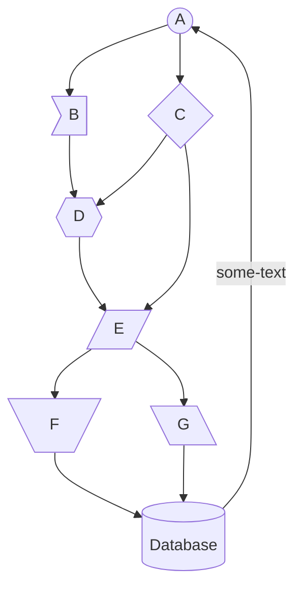
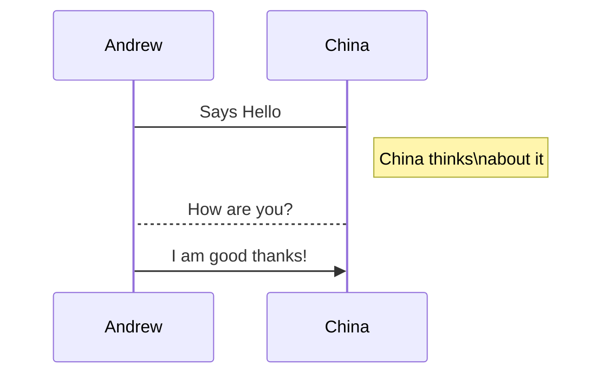
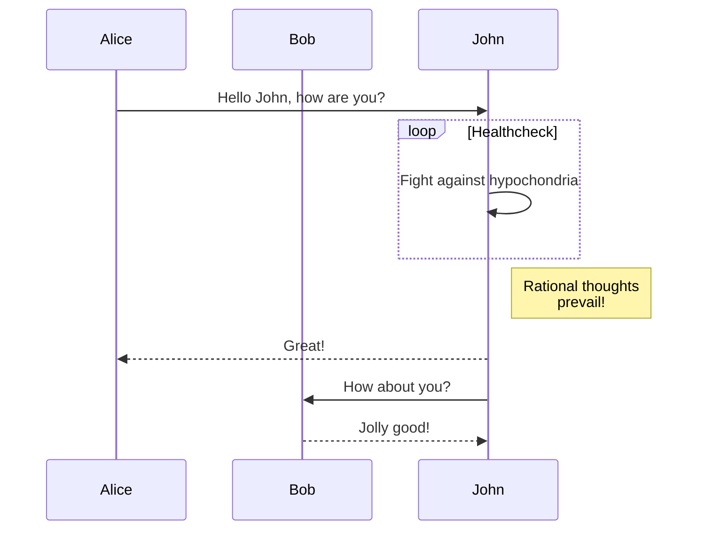

**Contents**
* This will become a table of contents (this text will be scrapped).
{:toc}

# Math

## Inline, display, square root and fraction

When @a \ne 0@, there are two solutions to @ax^2 + bx + c = 0@ and they are:

- fraction using `\over`

@@x = {-b \pm \sqrt{b^2-4ac} \over 2a}@@.

- fraction using `\fraction`

@@\left(\frac{x^2}{y^3}\right)@@	

### Summation and product

@@S_z^x(y) = \sum_{i=1}^y \left( \sum_{x'=0}^{x-1} S_z^{x'}(y-i) + \prod_{z'=0}^{z-1} S_{z'}^{z}(y-i) \right) = \bigcup^{\Omega} S{\infty} \bigcap_{\alpha\in U} T_{\alpha}@@

to get numbered equations:

@@
\begin{equation}
  f(k) = \binom{n}{k} p^k(1-p)^{n-k}
\end{equation}
@@

@@
\begin{equation*} 
    f(k)=\binom{n}{k} p^k(1-p)^{n-k}
  \end{equation*}
@@

some other text:
<hr>
### Alignment

  place am `&` before `=` to align and break lines using \newline 

@@\begin{align}
  \phi(x,y) & = \phi (\sum_{i=1}^n x_ie_i, \sum_{j=1} ^n y_je_j)  \newline
  & =  \sum_{i=1}^n \sum_{j=1}^n x_i y_j \phi(e_i, e_j) \newline
  & =  \left(x_1, \ldots, x_n \right) 
  \left( \begin{array}{ccc}
      \phi(e_1, e_1) & \cdots & \phi(e_1, e_n) \newline
      \vdots         & \ddots & \vdots         \newline
      \phi(e_n, e_1) & \cdots & \phi(e_n, e_n) \end{array} \right)
  \left( \begin{array}{c}  y_1 \newline
                      \vdots \newline 
                      y_n \end{array} \right)
  \end{align}@@
<hr>
@@\begin{equation}\sum_{i=0}^n i^2 = \frac{(n^2+n)(2n+1)}{6}\end{equation}@@
<hr>
@@
f(n) =
\begin{cases}
n/2,  & \text{if $n$ is even} \newline
3n+1, & \text{if $n$ is odd}
\end{cases}
@@
<hr>
### Typography

- Use `\mathbb` or \Bbb for "blackboard bold":
@@
  \begin{equation}
  \mathbb{ABCDEFGHIJKLMNOPQRSTUVWXYZ}
  \end{equation}
@@
- Use `\mathbf` for boldface: 
@@
  \begin{equation}
  \mathbf{ABCDEFGHIJKLMNOPQRSTUVWXYZ}
  \end{equation}
@@
- Use `\mathit` for italics:  
@@
  \begin{equation}
  \mathit{ABCDEFGHIJKLMNOPQRSTUVWXYZ}
  \end{equation}
@@
- Use `\pmb` for boldfaced italics: 
@@
  \begin{equation}
  \pmb{ABCDEFGHIJKLMNOPQRSTUVWXYZ}
  \end{equation}
@@
- Use `\mathtt` for "typewriter" font: 
@@
  \begin{equation}
  \mathtt{ABCDEFGHIJKLMNOPQRSTUVWXYZ}
  \end{equation}
@@
- Use `\mathrm` for roman font: @@
  \begin{equation}
  \mathrm{ABCDEFGHIJKLMNOPQRSTUVWXYZ}
  \end{equation}
@@
- Use `\mathsf` for sans-serif font: 
@@
  \begin{equation}
  \mathsf{ABCDEFGHIJKLMNOPQRSTUVWXYZ}
  \end{equation}
@@

- Use `\mathcal` for "calligraphic" letters: 
@@
  \begin{equation}
  \mathcal{ABCDEFGHIJKLMNOPQRSTUVWXYZ}
  \end{equation}
@@

- Use `\mathscr` for script letters: 
@@
  \begin{equation}
  \mathscr{ABCDEFGHIJKLMNOPQRSTUVWXYZ}
  \end{equation}
@@

- Use `\mathfrak` for "Fraktur" (old German style) letters:
@@
\begin{equation}
  \mathfrak{ABCDEFGHIJKLMNOPQRSTUVWXYZ} \\
  \mathfrak{abcdefghijklmnopqrstuvwxyz}
\end{equation}@@

<!--
## Commutative Diagram
@@
\require{AMScd}
\begin{CD}
A @>a>> B\\
@V b V V= @VV c V\\
C @>>d> D
\end{CD}
@@
-->

## Matrix

@@ \left[
  \begin{array}{ c c }
     1 & 2 \newline
     3 & 4
  \end{array} \right]
@@

## Chemistry

@@\require{AMScd}
\begin{CD}
  RCOHR'SO_3Na @>{\text{Hydrolysis,$\Delta, Dil.HCl$}}>> (RCOR')+NaCl+SO_2+ H_2O 
\end{CD}@@

## Tags
To tag an equation use `\tag{yourtag}`, and if you want to refer to that tag later on, add `\label`{somelabel} right after the `\tag`. It is not necessary that yourtag and somelabel are the same, but it usually is more convenient to do so:

@@e=mc^2 \tag{1}\label{eq1}@@

In order to refer to an equation, just use `\eqref{eq1}` to get \eqref{eq1}

@@ a+y^3 \stackrel{\eqref{eq1}}= x^2 @@

## Limits
@@\lim\limits_{x \to 1} \frac{x^2-1}{x-1}@@

# Alerts	

this is how I'd alerts to be coded - in fact

```
::: Note 
This is my note. All the content I type here is 
treated as a single paragraph.
:::
```

which looks like: 

::: Note 
This is my note. All the content I type here is 
treated as a single paragraph.
:::

Center-aligned
{: .alert .alert-info .text-center}








# Footnotes

```
You can find a demo of a site[^Demo] built with PostCSS in our footnotes, or you can checkout the [^Github Repo] for the project.

[Demo](http://iviewsource.com/exercises/postcsslayouts)
[Github Repo](https://github.com/planetoftheweb/postcsslayouts)
```

You can find a demo of a site[^Demo] built with PostCSS in our footnotes, or you can checkout the [^Github Repo] for the project.

[Demo](http://iviewsource.com/exercises/postcsslayouts)
[Github Repo](https://github.com/planetoftheweb/postcsslayouts)

# Mermaids charts

## Flowchart



<div class="mermaid">
graph TD;
    A((A))-->B>B];
    A-->C{C};
    B-->D{{D}};
    C-->D;
    C-->E;
    D-->E[/E/];
    E-->F[\F/];
    E-->G[\G\];
    G-->H[(Database)];
    F-->H
    H--some-text-->A
</div>


## Sequence Diagrams



<div class="mermaid">
sequenceDiagram
  Andrew->China: Says Hello
  Note right of China: China thinks\nabout it
  China-->Andrew: How are you?
  Andrew->>China: I am good thanks!
</div>

a more complex example:



yields:

<div class="mermaid">
sequenceDiagram
    participant Alice
    participant Bob
    Alice->>John: Hello John, how are you?
    loop Healthcheck
        John->>John: Fight against hypochondria
    end
    Note right of John: Rational thoughts <br/>prevail!
    John-->>Alice: Great!
    John->>Bob: How about you?
    Bob-->>John: Jolly good!
</div>


## State Diagram

~~~
stateDiagram-v2
  [*] --> Still
  Still --> [*]
  Still --> Moving
  Moving --> Still
  Moving --> Crash
  Crash --> [*]
~~~

<div class="mermaid">
stateDiagram-v2
  [*] --> Still
  Still --> [*]
  Still --> Moving
  Moving --> Still
  Moving --> Crash
  Crash --> [*]
</div>

## Entity Relationship Diagram

~~~
erDiagram
    CUSTOMER ||--o{ ORDER : places
    CUSTOMER {
        string name
        string custNumber
        string sector
    }
    ORDER ||--|{ LINE-ITEM : contains
    ORDER {
        int orderNumber
        string deliveryAddress
    }
    LINE-ITEM {
        string productCode
        int quantity
        float pricePerUnit
    }
~~~

<div class="mermaid">
erDiagram
    CUSTOMER ||--o{ ORDER : places
    CUSTOMER {
        string name
        string custNumber
        string sector
    }
    ORDER ||--|{ LINE-ITEM : contains
    ORDER {
        int orderNumber
        string deliveryAddress
    }
    LINE-ITEM {
        string productCode
        int quantity
        float pricePerUnit
    }
</div>


## User Journey Diagram

~~~
journey
    title My working day
    section Go to work
      Make tea: 5: Me
      Go upstairs: 3: Me
      Do work: 1: Me, Cat
    section Go home
      Go downstairs: 5: Me
      Sit down: 5: Me
~~~

<div class="mermaid">
journey
    title My working day
    section Go to work
      Make tea: 5: Me
      Go upstairs: 3: Me
      Do work: 1: Me, Cat
    section Go home
      Go downstairs: 5: Me
      Sit down: 5: Me
</div>

## Class Diagram

~~~
classDiagram
    Class01 <|-- AveryLongClass : Cool
    Class03 *-- Class04
    Class05 o-- Class06
    Class07 .. Class08
    Class09 --> C2 : Where am i?
    Class09 --* C3
    Class09 --|> Class07
    Class07 : equals()
    Class07 : Object[] elementData
    Class01 : size()
    Class01 : int chimp
    Class01 : int gorilla
    Class08 <--> C2: Cool label
~~~

<div class="mermaid">
classDiagram
    Class01 <|-- AveryLongClass : Cool
    Class03 *-- Class04
    Class05 o-- Class06
    Class07 .. Class08
    Class09 --> C2 : Where am i?
    Class09 --* C3
    Class09 --|> Class07
    Class07 : equals()
    Class07 : Object[] elementData
    Class01 : size()
    Class01 : int chimp
    Class01 : int gorilla
    Class08 <--> C2: Cool label
</div>


## Gantt diagram

```
gantt
    title A Gantt Diagram
    dateFormat  YYYY-MM-DD
    section Section
    A task           :a1, 2014-01-01, 30d
    Another task     :after a1  , 20d
    section Another
    Task in sec      :2014-01-12  , 12d
    another task      : 24d
```

<div class="mermaid">
gantt
    title A Gantt Diagram
    dateFormat  YYYY-MM-DD
    section Section
    A task           :a1, 2014-01-01, 30d
    Another task     :after a1  , 20d
    section Another
    Task in sec      :2014-01-12  , 12d
    another task      : 24d
</div>

a more advanced version

``` 
gantt
    dateFormat  YYYY-MM-DD
    title       Adding GANTT diagram functionality to mermaid
    excludes    weekends
    %% (`excludes` accepts specific dates in YYYY-MM-DD format, days of the week ("sunday") or "weekends", but not the word "weekdays".)

    section A section
    Completed task            :done,    des1, 2014-01-06,2014-01-08
    Active task               :active,  des2, 2014-01-09, 3d
    Future task               :         des3, after des2, 5d
    Future task2              :         des4, after des3, 5d

    section Critical tasks
    Completed task in the critical line :crit, done, 2014-01-06,24h
    Implement parser and jison          :crit, done, after des1, 2d
    Create tests for parser             :crit, active, 3d
    Future task in critical line        :crit, 5d
    Create tests for renderer           :2d
    Add to mermaid                      :1d

    section Documentation
    Describe gantt syntax               :active, a1, after des1, 3d
    Add gantt diagram to demo page      :after a1  , 20h
    Add another diagram to demo page    :doc1, after a1  , 48h

    section Last section
    Describe gantt syntax               :after doc1, 3d
    Add gantt diagram to demo page      :20h
    Add another diagram to demo page    :48h
```

<div class="mermaid">
gantt
    dateFormat  YYYY-MM-DD
    title       Adding GANTT diagram functionality to mermaid
    excludes    weekends
    %% (`excludes` accepts specific dates in YYYY-MM-DD format, days of the week ("sunday") or "weekends", but not the word "weekdays".)

    section A section
    Completed task            :done,    des1, 2014-01-06,2014-01-08
    Active task               :active,  des2, 2014-01-09, 3d
    Future task               :         des3, after des2, 5d
    Future task2              :         des4, after des3, 5d

    section Critical tasks
    Completed task in the critical line :crit, done, 2014-01-06,24h
    Implement parser and jison          :crit, done, after des1, 2d
    Create tests for parser             :crit, active, 3d
    Future task in critical line        :crit, 5d
    Create tests for renderer           :2d
    Add to mermaid                      :1d

    section Documentation
    Describe gantt syntax               :active, a1, after des1, 3d
    Add gantt diagram to demo page      :after a1  , 20h
    Add another diagram to demo page    :doc1, after a1  , 48h

    section Last section
    Describe gantt syntax               :after doc1, 3d
    Add gantt diagram to demo page      :20h
    Add another diagram to demo page    :48h

</div>

## Pie Chart

<div class="mermaid">
pie
    title: Pets adopted by volunteers
    "Cats" : 85
    "Dogs" : 386
    "Rats" : 35
</div>

## Git graph

<div class="mermaid">
gitGraph:
options
{
    "nodeSpacing": 150,
    "nodeRadius": 10
}
end
  commit
  branch newbranch
  checkout newbranch
  commit
  commit
  checkout master
  commit
  commit
  merge newbranch
</div>


__Example:__

```bash

```

If you feel like quoting war and peace, 

{% include callout.html content="There's a passage I got memorized. ***Ezekiel 25:17***. 

\"The path of the righteous man is beset on all sides by the inequities of the selfish and the tyranny of evil men. Blessed is he who, in the name of charity and good will, shepherds the weak through the valley of the darkness, for he is truly his brother's keeper and the finder of lost children. And I will strike down upon thee with great vengeance and furious anger those who attempt to poison and destroy My brothers. And you will know I am the Lord when I lay My vengeance upon you.\" <br/>
 
 Now... I been sayin' that shit for years. And if you ever heard it, that meant your ass. You'd be dead right now. I never gave much thought to what it meant. I just thought it was a cold-blooded thing to say to a motherfucker before I popped a cap in his ass. But I saw some shit this mornin' made me think twice. See, now I'm thinking: maybe it means you're the evil man. And I'm the righteous man. And Mr. 9mm here... he's the shepherd protecting my righteous ass in the valley of darkness. Or it could mean you're the righteous man and I'm the shepherd and it's the world that's evil and selfish. And I'd like that. But that shit ain't the truth. The truth is you're the weak. And I'm the tyranny of evil men. But I'm tryin', Ringo. I'm tryin' real hard to be the shepherd." type="primary" %}


# Footnotes

Footnotes come in two halfs: first the bit that goes inline in your text:

```bash
A long rambling sentence [^1]
```

The second bit is the reference at the bottom of your page:

```bash
[^1]: Some sort of expansion on the rambling sentence.
```


This renders something like this:

<p>Watch out <a href="http://www.bargainhardware.co.uk/">Bargain Hardware</a> - there will be some orders coming your way soon… <sup id="fnref:1"><a href="#fn:1" class="footnote">1</a></sup></p>


And then down at the bottom of the page:

<p>Hashtag <strong>getinbeforebrexit</strong>&nbsp;<a href="#fnref:1" class="reversefootnote">↩</a></p>

# A side note

If you'd like some more flexibility over the alerts and callouts described above, try a side note box:

```html
<div class="notebox">
     <b>A small sidebar on accessModes</b>
     
     <p>
     The access modes govern the cardinality of PV to node:
 
     <ul>
     <li>ReadWriteOnce – the volume can be mounted as read-write by a single node</li>
     <li>ReadOnlyMany – the volume can be mounted read-only by many nodes</li>
     <li>ReadWriteMany – the volume can be mounted as read-write by many nodes</li>
     </ul>
     
     In the CLI, the access modes are abbreviated to:
     
     <ul>
     <li>RWO - ReadWriteOnce</li>
     <li>ROX - ReadOnlyMany</li>
     <li>RWX - ReadWriteMany</li>
     </ul>
     </p>
</div>

```

This looks like:

<div class="notebox">
     <b>A small sidebar on accessModes</b>
     
     <p>
     The access modes govern the cardinality of PV to node:
 
     <ul>
     <li>ReadWriteOnce – the volume can be mounted as read-write by a single node</li>
     <li>ReadOnlyMany – the volume can be mounted read-only by many nodes</li>
     <li>ReadWriteMany – the volume can be mounted as read-write by many nodes</li>
     </ul>
     
     In the CLI, the access modes are abbreviated to:
     
     <ul>
     <li>RWO - ReadWriteOnce</li>
     <li>ROX - ReadOnlyMany</li>
     <li>RWX - ReadWriteMany</li>
     </ul>
     </p>
</div>

# Images

There is an image include html snippet that comes with some syntactic sugar:
1. Image borders are standard as per the preference of yours truly
2. Clicking on an images give you a modal light box
3. There's a default 'gallery' created of each image on the page. You get this for free.


```

```

This looks like:



# Giphy





# See also

- [jekyll-diagrams](https://github.com/zhustec/jekyll-diagrams#state-machine-cat) provides support for
  - PlanetUML charts requires a jvm to run.
  - [state-machine-cat](https://github.com/sverweij/state-machine-cat)
  - many more - currently crashes jekyll so not implemented.
- [emoji](https://github.com/ikatyang/emoji-cheat-sheet)
- [syntrax](https://kevinpt.github.io/syntrax/) is python based
- [railroad diagram generator](https://www.bottlecaps.de/rr/ui)
- [tex stack exchange tutorial](https://math.meta.stackexchange.com/questions/5020/mathjax-basic-tutorial-and-quick-reference/30661#30661)
- [jekyll-cheat-sheet](https://maxodnovolyk.com/jekyll-cheat-sheet/)
- [origin for this page](https://raymondc.net/docs/cheat_sheet.html)
- [emoji](https://www.webfx.com/tools/emoji-cheat-sheet/)
